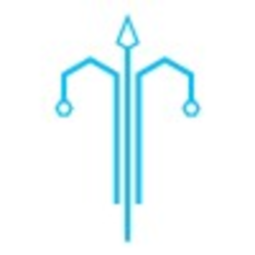

  
   

  <h3><b>Pazouki Portfolio</b></h3>

<!-- TABLE OF CONTENTS -->

# 📗 Table of Contents

- [📖 About the Project](#about-project)
  - [🛠 Built With](#built-with)
    - [Tech Stack](#tech-stack)
  - [🚀 Live Demo](#live-demo)
- [👥 Authors](#authors)
- [🤝 Contributing](#contributing)
- [🙏 Acknowledgements](#acknowledgements)
- [📝 License](#license)

<!-- PROJECT DESCRIPTION -->

# 📖 Pazouki Portfolio 

> It is first project of microverse to show how I use tools.

**Hello Microverse** is a fun project of tools usage.

## 🛠 Built With 

### Tech Stack 

> This project implemented HTML, CSS and JS.

  
Client

  <ul>
    <li><a href="https://javascript.org/">JavaScript</a></li>
  </ul>

  
Server

  <ul>
    <li><a href="https://apache.com/">Apache</a></li>
  </ul>

Database

  <ul>
    <li><a href="https:///">No database</a></li>
  </ul>

<!-- LIVE DEMO -->

## 🚀 Live Demo 

- [Live Demo](https://google.com)

<!-- AUTHORS -->

## 👥 Authors 

👤 **Author1**

- GitHub: [@mm-pazouki](https://github.com/mm-pazouki)
- Twitter: [@mm-pazouki](https://twitter.com/mm-pazouki)
- LinkedIn: [Mohammad Mehdi Pazouki](https://linkedin.com/in/mohammad-mehdi-pazouki)

(<a href="#readme-top">back to top</a>)

<!-- CONTRIBUTING -->

## 🤝 Contributing 

Contributions, issues, and feature requests are welcome!

Feel free to check the [issues page](../../issues/).

(<a href="#readme-top">back to top</a>)

<!-- ACKNOWLEDGEMENTS -->

## 🙏 Acknowledgments 

I would like to thank microverse to help me create this portfolio.

(<a href="#readme-top">back to top</a>)

<!-- LICENSE -->

## 📝 License 

This project is [MIT](./LICENSE) licensed.

(<a href="#readme-top">back to top</a>)

